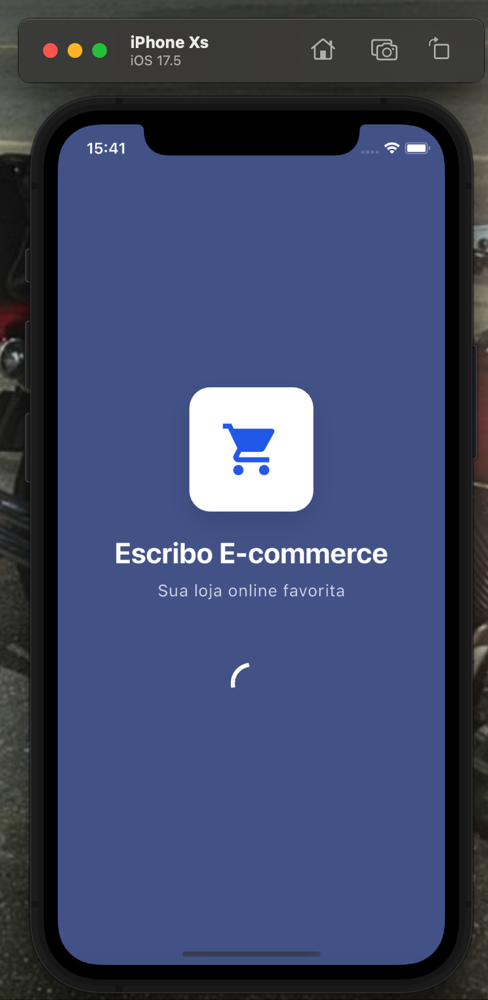
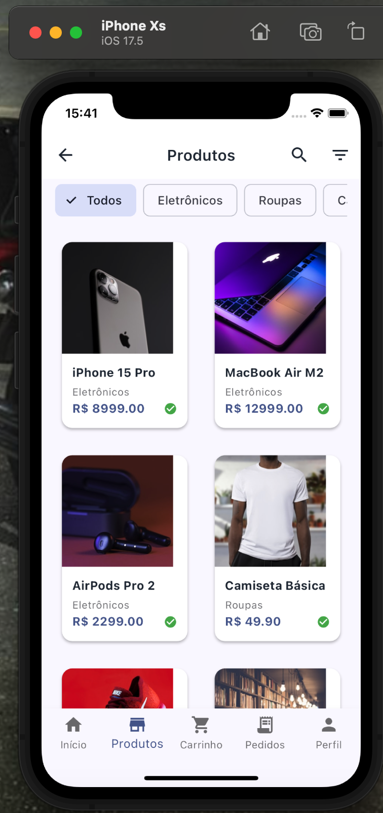
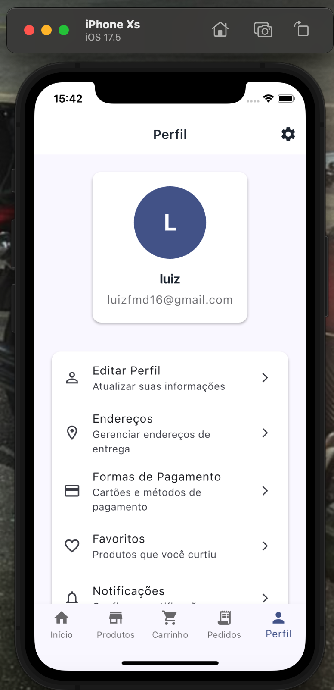

# 🛒 Escribo E-commerce

Um aplicativo de e-commerce moderno desenvolvido em Flutter com integração Stripe e Supabase.


## 📱 Screenshots

### Tela Inicial e Autenticação



### Navegação e Produtos




### Carrinho e Checkout


## ✨ Funcionalidades

- 🔐 **Autenticação completa** com Supabase
- 🛍️ **Catálogo de produtos** com busca e filtros
- 🛒 **Carrinho de compras** persistente
- 💳 **Pagamentos seguros** com Stripe
- 📱 **Design responsivo** para iOS e Android
- 🔄 **Sincronização em tempo real** com backend
- 📊 **Analytics e relatórios** integrados
- 🔔 **Notificações push** personalizadas

## 🚀 Tecnologias Utilizadas

- **Flutter** - Framework de desenvolvimento mobile
- **Dart** - Linguagem de programação
- **Supabase** - Backend como serviço (BaaS)
- **Stripe** - Processamento de pagamentos
- **Riverpod** - Gerenciamento de estado
- **Go Router** - Navegação
- **Hive** - Armazenamento local

## 📋 Pré-requisitos

Antes de começar, certifique-se de ter instalado:

- [Flutter SDK](https://flutter.dev/docs/get-started/install) (versão 3.0.0 ou superior)
- [Dart SDK](https://dart.dev/get-dart) (incluído com Flutter)
- [Android Studio](https://developer.android.com/studio) ou [VS Code](https://code.visualstudio.com/)
- [Git](https://git-scm.com/)

### Para iOS (macOS apenas):
- [Xcode](https://developer.apple.com/xcode/) (versão 14.0 ou superior)
- [CocoaPods](https://cocoapods.org/)

## 🛠️ Instalação

### 1. Clone o repositório

```bash
git clone https://github.com/seu-usuario/escribo-ecommerce.git
cd escribo-ecommerce/frontend/flutter-ecommerce-stripe
```

### 2. Instale as dependências

```bash
flutter pub get
```

### 3. Configure as variáveis de ambiente

Copie o arquivo de exemplo e configure suas credenciais:

```bash
cp env.example .env
```

Edite o arquivo `.env` com suas configurações:

```env
# Supabase Configuration
SUPABASE_URL=sua_url_do_supabase
SUPABASE_ANON_KEY=sua_chave_anonima_do_supabase
SUPABASE_SERVICE_ROLE_KEY=sua_chave_de_servico_do_supabase

# Stripe Configuration
STRIPE_PUBLIC=sua_chave_publica_do_stripe

# Email Configuration
SMTP_HOST=seu_smtp_host
SMTP_PORT=587
SMTP_USER=seu_usuario_smtp
SMTP_PASS=sua_senha_smtp
```

### 4. Configuração do iOS (apenas no macOS)

```bash
cd ios
pod install
cd ..
```

### 5. Execute o aplicativo

#### Para Android:
```bash
flutter run
```

#### Para iOS:
```bash
flutter run -d ios
```

#### Para Web:
```bash
flutter run -d web-server --web-port 8080
```

## 📱 Build para Produção

### Android APK

```bash
flutter build apk --release
```

### Android App Bundle (recomendado para Play Store)

```bash
flutter build appbundle --release
```

### iOS

```bash
flutter build ios --release
```

### Web

```bash
flutter build web --release
```

## 🗂️ Estrutura do Projeto

```
lib/
├── core/                 # Configurações centrais
│   ├── constants/        # Constantes da aplicação
│   ├── routing/          # Configuração de rotas
│   └── services/         # Serviços globais
├── features/             # Funcionalidades da aplicação
│   ├── auth/            # Autenticação
│   ├── products/        # Produtos
│   ├── cart/            # Carrinho
│   ├── orders/          # Pedidos
│   └── profile/         # Perfil do usuário
└── main.dart            # Ponto de entrada
```

## 🔧 Scripts Disponíveis

```bash
# Instalar dependências
flutter pub get

# Executar em modo debug
flutter run

# Executar testes
flutter test

# Análise de código
flutter analyze

# Limpar cache
flutter clean

# Gerar código (Hive)
flutter packages pub run build_runner build
```

## 🐛 Solução de Problemas

### Problema: "No devices found"
- Certifique-se de que o dispositivo está conectado via USB
- Habilite a depuração USB no dispositivo
- Para emulador: inicie o emulador antes de executar `flutter run`

### Problema: "CocoaPods not found" (iOS)
```bash
sudo gem install cocoapods
cd ios && pod install
```

### Problema: Dependências desatualizadas
```bash
flutter clean
flutter pub get
```

## 🤝 Contribuindo

1. Faça um fork do projeto
2. Crie uma branch para sua feature (`git checkout -b feature/AmazingFeature`)
3. Commit suas mudanças (`git commit -m 'Add some AmazingFeature'`)
4. Push para a branch (`git push origin feature/AmazingFeature`)
5. Abra um Pull Request

## 📄 Licença

Este projeto está sob a licença MIT. Veja o arquivo [LICENSE](LICENSE) para mais detalhes.

## 📞 Suporte

Se você encontrar algum problema ou tiver dúvidas, abra uma [issue](https://github.com/seu-usuario/escribo-ecommerce/issues) no GitHub.

## 🙏 Agradecimentos

- [Flutter Team](https://flutter.dev/) pelo framework incrível
- [Supabase](https://supabase.com/) pelo backend robusto
- [Stripe](https://stripe.com/) pela solução de pagamentos
- Comunidade Flutter pelo suporte contínuo

---

Desenvolvido com ❤️ pela equipe Escribo
